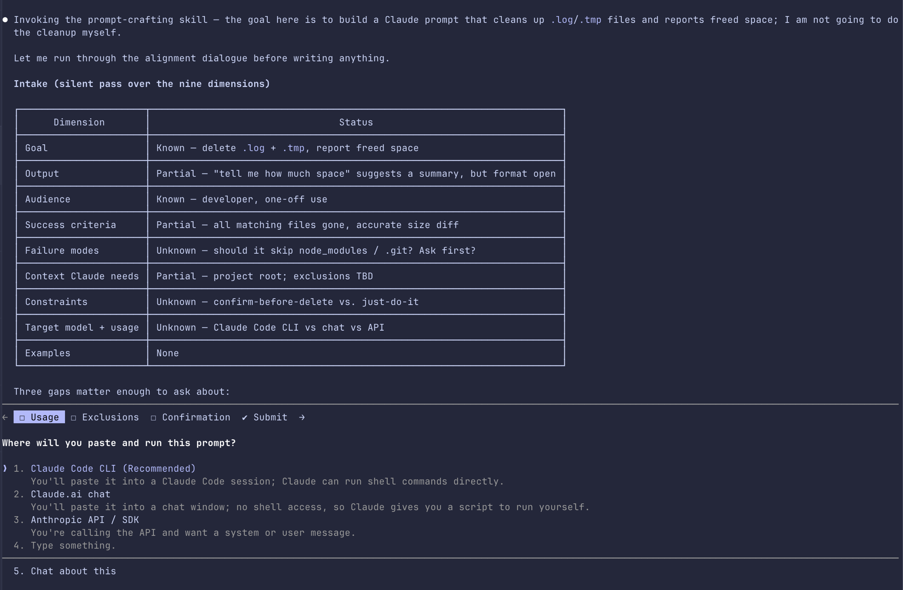
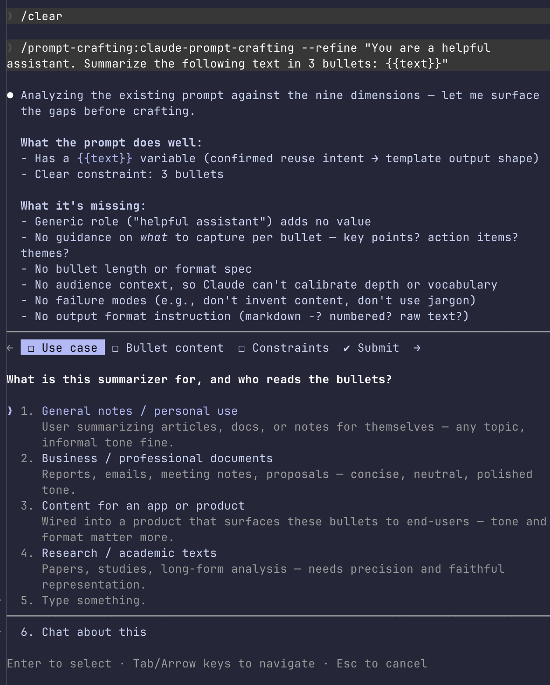
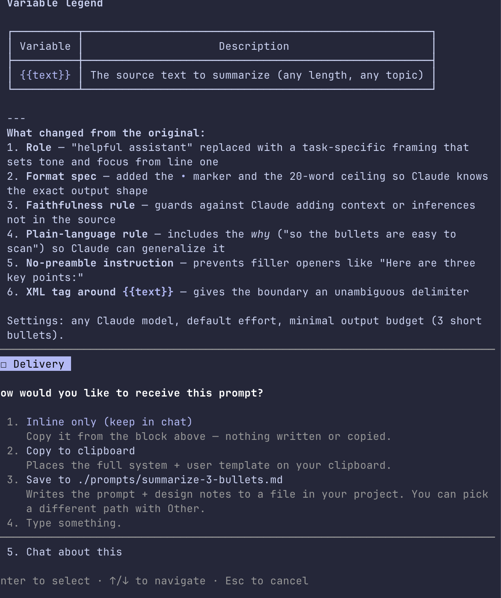
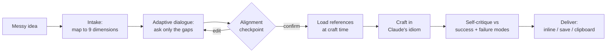

<div align="center">

# 🔥 skill-forge

**A growing collection of high-quality, installable [Claude Code](https://claude.com/claude-code) skills.**

First plugin: **prompt-crafting** — turn a rough idea into a production-grade prompt for **Claude**, through a short alignment dialogue, grounded in Anthropic's official prompt-engineering guidance.

[](https://github.com/Mediacom99/skill-forge/actions/workflows/validate.yml)
[](LICENSE)


</div>

<p align="center">
  
  <br>
  <em>Ask it to delete your files and it won't — it crafts you a prompt for that goal instead, then aligns on the details.</em>
</p>

---

## Why

The quality of any LLM output is overwhelmingly determined by the prompt — yet most prompts are written cold, in one shot, from a half-formed idea. **skill-forge** packages a better workflow as installable skills: a sharp **alignment dialogue** that nails down what you actually want *before* a single line is written, then a **craft step** grounded in Anthropic's official guidance.

You bring a messy idea; you leave with a prompt that works — either a clean, ready-to-use prompt, or (with `--template`) a reusable, parameterized version you can wire straight into your API calls.

**What makes it different:**

- **Align first, then craft** — it pins down your intent before writing, so you don't get a confident prompt for the wrong goal.
- **Grounded in official docs** — every technique is distilled from Anthropic's own prompt-engineering guides, each claim **sourced, dated, and kept current** as the docs change.
- **Safe by construction** — read-only: it crafts a prompt *for* your task and never runs the task, edits your code, or touches your shell.
- **Two outputs, one workflow** — improve a one-off prompt, or `--template` a reusable, API-ready template.
- **Built for current Claude** — applies the latest official guidance across the lineup (Opus 4.8 · Sonnet 4.6 · Haiku 4.5 · Fable 5): system/user split, XML structure, multishot, `effort` + output budget, prefill-free formatting.

## Table of contents

- [Quick start](#quick-start)
- [What you get](#what-you-get)
- [See it work](#see-it-work)
- [How it works](#how-it-works)
- [Flags & modes](#flags--modes)
- [Provenance & freshness](#provenance--freshness)
- [Repo layout](#repo-layout)
- [Contributing](#contributing)
- [License](#license)

## Quick start

Inside Claude Code:

```text
/plugin marketplace add Mediacom99/skill-forge
/plugin install prompt-crafting@skill-forge
```

That's it — now invoke it:

```text
/claude-prompt-crafting   I want something that reads support emails and tells me how angry the customer is
/claude-prompt-crafting   --template a system prompt for an agent that triages our failing tests
```

> Maintainers can also install the upkeep tooling: `/plugin install maintenance@skill-forge`

<details>
<summary><b>Alternative: install without the plugin marketplace (git clone)</b></summary>

You can drop the skills straight into your skills folder (no auto-update, no `/plugin` UI):

```bash
git clone https://github.com/Mediacom99/skill-forge.git
cp -r skill-forge/plugins/prompt-crafting/skills/* ~/.claude/skills/
```

The plugin-marketplace path above is recommended — it gives you discovery and automatic updates.
</details>

## What you get

| Skill | Invoke | What it does |
|-------|--------|--------------|
| **claude-prompt-crafting** | `/claude-prompt-crafting` | Crafts or improves a production-grade prompt **for Claude** in Claude's idiom (XML structure, multishot, effort/budget); `--template` adds a reusable system+user split with variables. Grounded in Anthropic's official docs. |
| **refresh-references** *(maintenance)* | `/refresh-references` | Maintainer tool: re-fetches the official source docs behind a skill's references, diffs them, and proposes updates. |

It also **refines existing prompts** — paste one and ask to improve it. By default it returns an improved, ready-to-use prompt; add **`--template`** for a reusable, parameterized version.

## See it work

A real run — paste a rough prompt, and it diagnoses the gaps, crafts a better one, and hands it over.

**1. Align** — it maps your prompt onto the nine dimensions and asks only what's missing (including whether you want a one-off prompt or a reusable template):



**2. Craft & deliver** — it rebuilds the prompt, explains every change, and always asks how you want it — it never saves silently:



## How it works

The skill runs an **align first, then craft** engine:



A prompt spec is "ready to craft" once these **nine dimensions** are pinned — the skill asks only about the ones your idea leaves open:

> **goal** · **output** · **audience** · **success criteria** · **failure modes** · **context the model needs** · **constraints** · **target model + how it's used** · **examples available**

Heavy technique libraries load **only at the craft step** (progressive disclosure), so the dialogue stays cheap.

**Safe by construction — with hard boundaries.** The skill is read-only: it reads, asks, copies to your
clipboard, and writes exactly *one* file — the finished prompt, and only when you choose *save*. No edits to
your code and no arbitrary shell, even in auto mode (enforced via scoped `allowed-tools`: read tools +
`Write` + a fixed set of clipboard commands). Each run is bounded: it **opens** by confirming the single
prompt it's crafting and **closes** by asking where you want it — it crafts that one prompt and nothing else.

## Flags & modes

| Flag | Effect |
|------|--------|
| *(none)* | Standard: one to two focused rounds of questions. Returns an **improved, ready-to-use prompt** by default. |
| `--quick` | One short round max; fills gaps with sensible, stated assumptions. |
| `--deep` | Exhaustive alignment, loads the advanced reference appendix, and offers a dry test-run (paper simulation) before delivery. |
| `--refine` | Treat the input as an existing prompt to diagnose and upgrade (also auto-detected when you paste one). |
| `--template` | Output a **reusable, parameterized template** (system/user split + `{{variables}}`) instead of a one-off prompt — also auto-detected when reuse is clearly intended. |

## Provenance & freshness

Every technique in the references is **sourced and dated**. The skill's `references/_sources.md` lists the exact official URLs it was distilled from, a `last-verified` date, and a "volatile items" list (model IDs, reasoning settings — the things that change). Three layers keep it current:

1. **Sourced + dated** references, with stable principles separated from clearly-flagged volatile facts.
2. **`/refresh-references`** — one command re-fetches the sources, diffs them, and proposes updates.
3. **`check-sources.yml`** — a weekly GitHub Action that detects when a source doc changes and opens an issue telling the maintainer to refresh. No LLM, no secrets — just fetch + hash.

This is a prompt-engineering tool, so trustworthiness matters: you can always see *where every claim came from* and *how fresh it is*.

## Repo layout

```
skill-forge/                         # this repo IS the marketplace
├── .claude-plugin/marketplace.json  # lists the plugins
├── plugins/
│   ├── prompt-crafting/             # the prompt-crafting skill
│   │   └── skills/claude-prompt-crafting/{SKILL.md, references/}
│   └── maintenance/                 # refresh-references
├── .github/
│   ├── workflows/{validate,check-sources}.yml
│   └── scripts/{validate,check_sources}.py
├── README.md · MAINTAINING.md · CHANGELOG.md · LICENSE
```

## Contributing

New skills are welcome — the repo is built to grow. See **[MAINTAINING.md](MAINTAINING.md)** for the
"add a skill" and "add a plugin" recipes and how the freshness system works. The `validate` workflow keeps `main` installable; please make sure it passes.

## License

[MIT](LICENSE) © Mediacom99. Built on the official prompt-engineering guidance of
**[Anthropic](https://platform.claude.com/docs/en/build-with-claude/prompt-engineering/overview)** — see the skill's
`references/_sources.md` for exact citations.
