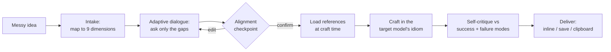

<div align="center">

# 🔥 skill-forge

**A growing collection of high-quality, installable [Claude Code](https://claude.com/claude-code) skills.**

First plugin: **prompt-crafting** — turn a rough idea into a production-grade prompt for **Claude** or **GPT**, through a short alignment dialogue, grounded in each vendor's official prompt-engineering guidance.

[](https://github.com/Mediacom99/skill-forge/actions/workflows/validate.yml)
[](LICENSE)


</div>

---

## Why

The quality of any LLM output is overwhelmingly determined by the prompt — yet most prompts are written cold, in one shot, from a half-formed idea. **skill-forge** packages a better workflow as installable skills: a sharp **alignment dialogue** that fully understands what you want *before* a single line of prompt is written, then a **craft step** grounded in the target model's official guidance. You bring a messy idea; you leave with a prompt that actually works.

## Table of contents

- [Quick start](#quick-start)
- [What you get](#what-you-get)
- [See it work](#see-it-work)
- [How it works](#how-it-works)
- [Flags & modes](#flags--modes)
- [Provenance & freshness](#provenance--freshness)
- [Repo layout](#repo-layout)
- [Contributing](#contributing)
- [License](#license)

## Quick start

Inside Claude Code:

```text
/plugin marketplace add Mediacom99/skill-forge
/plugin install prompt-crafting@skill-forge
```

That's it — now invoke either skill:

```text
/claude-prompt-crafting   I want something that reads support emails and tells me how angry the customer is
/gpt-prompt-crafting      an agent that fixes failing tests in our repo
```

> Maintainers can also install the upkeep tooling: `/plugin install maintenance@skill-forge`

<details>
<summary><b>Alternative: install without the plugin marketplace (git clone)</b></summary>

You can drop the skills straight into your skills folder (no auto-update, no `/plugin` UI):

```bash
git clone https://github.com/Mediacom99/skill-forge.git
cp -r skill-forge/plugins/prompt-crafting/skills/* ~/.claude/skills/
```

The plugin-marketplace path above is recommended — it gives you discovery and automatic updates.
</details>

## What you get

| Skill | Invoke | What it does |
|-------|--------|--------------|
| **claude-prompt-crafting** | `/claude-prompt-crafting` | Crafts a production-grade prompt **for Claude** (system+user split, XML structure, multishot, effort/budget), grounded in Anthropic's official docs. |
| **gpt-prompt-crafting** | `/gpt-prompt-crafting` | Crafts a prompt **for OpenAI/GPT** (developer/system+user, Markdown structure, Structured Outputs) with a built-in **reasoning-vs-workhorse** branch, grounded in OpenAI's official docs. |
| **refresh-references** *(maintenance)* | `/refresh-references` | Maintainer tool: re-fetches the official source docs behind a skill's references, diffs them, and proposes updates. |

Both prompt skills also **refine existing prompts** — paste one and ask to improve it.

## See it work

```text
You:    /claude-prompt-crafting  write a blog post about our new feature, don't make it boring
Claude: A few quick things so I craft the right prompt, not a generic one:
        • Who's the reader — technical or not?
        • What does "works" look like — sign-ups, comprehension, shares?
        • Any facts about the feature I should hand the model?
        …
        [alignment checkpoint — a compact spec you confirm]
        [crafts a system + user prompt, in Claude's idiom, with design notes]
        How do you want it? (1) shown here  (2) saved to a file  (3) copied to clipboard
```

## How it works

Both prompt skills run the same engine — **align first, then craft**:



A prompt spec is "ready to craft" once these **nine dimensions** are pinned — the skill asks only about the ones your idea leaves open:

> **goal** · **output** · **audience** · **success criteria** · **failure modes** · **context the model needs** · **constraints** · **target model + how it's used** · **examples available**

Heavy technique libraries load **only at the craft step** (progressive disclosure), so the dialogue stays cheap.

## Flags & modes

| Flag | Effect |
|------|--------|
| *(none)* | Standard: one to two focused rounds of questions. |
| `--quick` | One short round max; fills gaps with sensible, stated assumptions. |
| `--deep` | Exhaustive alignment, loads the advanced reference appendix, and offers a real test-run before delivery. |
| `--refine` | Treat the input as an existing prompt to diagnose and upgrade (also auto-detected when you paste one). |

## Provenance & freshness

Every technique in the references is **sourced and dated**. Each skill's `references/_sources.md` lists the exact official URLs it was distilled from, a `last-verified` date, and a "volatile items" list (model IDs, reasoning settings — the things that change). Three layers keep it current:

1. **Sourced + dated** references, with stable principles separated from clearly-flagged volatile facts.
2. **`/refresh-references`** — one command re-fetches the sources, diffs them, and proposes updates.
3. **`check-sources.yml`** — a weekly GitHub Action that detects when a source doc changes and opens an issue telling the maintainer to refresh. No LLM, no secrets — just fetch + hash.

This is a prompt-engineering tool, so trustworthiness matters: you can always see *where every claim came from* and *how fresh it is*.

## Repo layout

```
skill-forge/                         # this repo IS the marketplace
├── .claude-plugin/marketplace.json  # lists the plugins
├── plugins/
│   ├── prompt-crafting/             # the two prompt skills
│   │   └── skills/{claude,gpt}-prompt-crafting/{SKILL.md, references/}
│   └── maintenance/                 # refresh-references
├── .github/
│   ├── workflows/{validate,check-sources}.yml
│   └── scripts/{validate,check_sources}.py
├── README.md · MAINTAINING.md · CHANGELOG.md · LICENSE
```

## Contributing

New skills are welcome — the repo is built to grow. See **[MAINTAINING.md](MAINTAINING.md)** for the
"add a skill" and "add a plugin" recipes and how the freshness system works. The `validate` workflow keeps `main` installable; please make sure it passes.

## License

[MIT](LICENSE) © Mediacom99. Built on the official prompt-engineering guidance of
**[Anthropic](https://platform.claude.com/docs/en/build-with-claude/prompt-engineering/overview)** and
**[OpenAI](https://developers.openai.com/api/docs/guides/prompt-engineering)** — see each skill's
`references/_sources.md` for exact citations.
